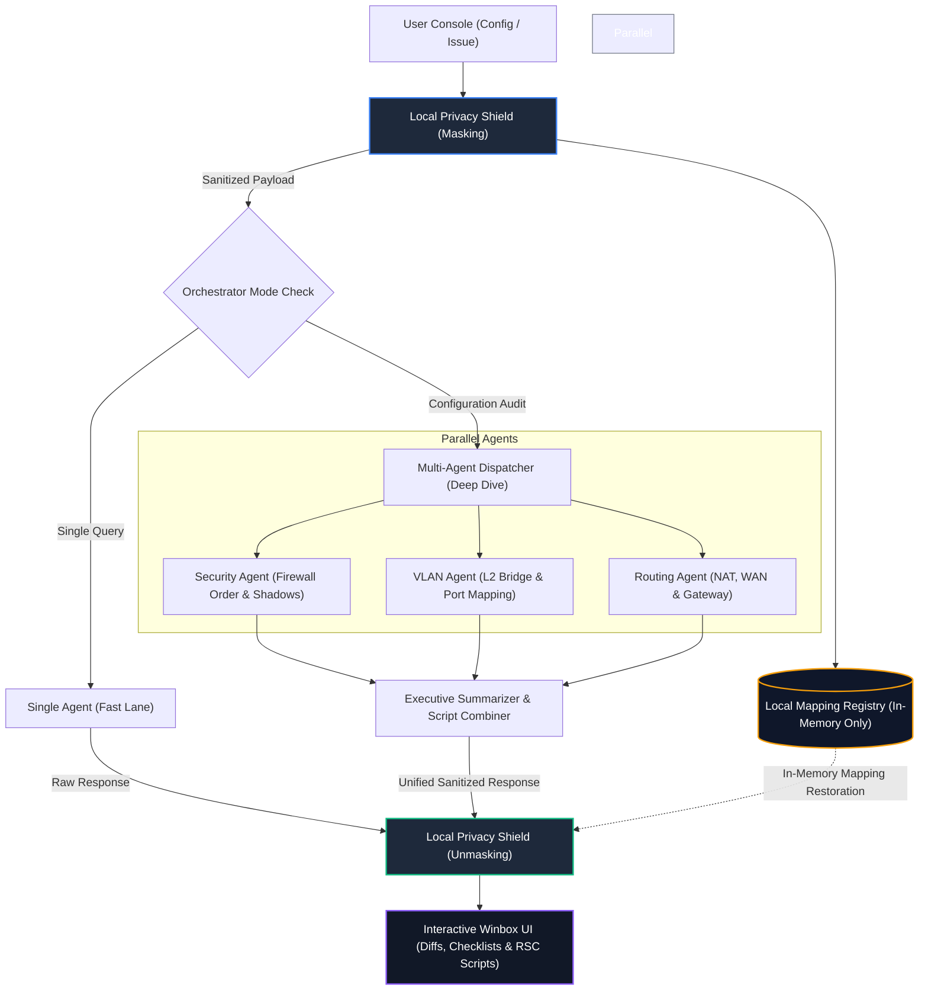

# MikrotikAssistant

<div align="center">

[](LICENSE)
[](https://nodejs.org/)
[](#-privacy-shield)
[](#-multi-agent-orchestrator)

**The Privacy-First, Multi-Agent RouterOS Configuration Auditor & Generator.**

</div>

---

## ⚡ Executive Summary

**MikrotikAssistant** is an enterprise-grade, privacy-centric utility designed specifically for network engineers, systems administrators, and security auditors managing MikroTik RouterOS (v6 & v7) deployments. Far beyond a generic chatbot, it represents a specialized diagnostic suite that couples a local **Privacy Shield** data scrubbing engine with a **Multi-Agent AI Orchestrator**. This ensures that complex configuration file audits, security vulnerability assessments, and target-syntax CLI script generation are executed without ever transmitting sensitive network coordinates or credential secrets to external LLMs.

---

## ✨ Key Features

### 🔒 Privacy Shield
The local sanitization pipeline completely strips network identity markers and secrets before dispatching payloads over the network.
* **Contextual Tokenization**: Automatically translates private/public IPv4 & IPv6 networks, MAC addresses, custom interface structures, routing tables, and device identities into generic, consistent tokens (e.g., `[PRIV_IP_1]`, `[IFACE_2]`).
* **Absolute Security**: Cryptographic credentials, SSH keys, passwords, and WPA pre-shared keys are instantly scrubbed in local memory.
* **In-Memory Demapping**: The translation dictionary remains strictly inside your local runtime context. When responses return from the LLM, original variables are seamlessly unmasked and displayed in the user interface.

### 🤖 Multi-Agent Orchestrator
When running in **Deep Dive Mode**, a dedicated orchestration system parallelizes the auditing pipeline:
* **Task Delegation**: Requests are split across specialized sub-agents focused on **Security Audit** (firewall rule shadows, vulnerable ports), **VLAN/Layer-2 Topology** (bridge configurations, trunk mismatches), and **Routing & WAN** (NAT rules, PPPoE/OSPF setups).
* **Synthesis & Reconciliation**: The orchestrator automatically aggregates parallel agent diagnostics into an actionable Executive Summary.
* **Unified Output**: Creates a singular, safe, and logically ordered RouterOS CLI script to execute the remediation delta.

### ⚡ Smart UX & Intent Detection
Engineered for rapid terminal integration, the interface adapts dynamically to operator behavior:
* **Smart Paste & Intent Detection**: Pasting or entering terminal configurations over 300 characters triggers keyword detection, auto-rendering dynamic suggestion chips, and generating brief configuration summaries.
* **Slash Commands**: Execute specialized workflows instantly (e.g., `/audit`, `/explain`).
* **Context Modifiers**: Tailor the technical depth of explanations and output scripts in real-time by appending `@strict` (enforces strict syntax & security standards) or `@beginner` (includes educational, verbose explanations).

### 🛠️ Pro Tools
* **RSC Script Export**: One-click export for corrected configurations in native MikroTik `.rsc` script format, complete with formatted metadata headers.
* **Visual Diff Viewer**: Interactive, line-by-line split (side-by-side) or unified differential comparison of original masked vs. corrected masked configurations.
* **Mermaid.js VLAN Topology Visualizer**: Automatically parses active Layer-2 configurations and renders standard, interactive, zoomable Mermaid.js topologies.
* **Firewall Shadow Rule Detector**: A specialized diagnostic route `/api/analyze-shadows` that parses rule blocks and flags unreachable, redundant, or shadowed firewall and NAT configurations.

---

## 📐 Architecture & Workflow

MikrotikAssistant splits execution pipelines to deliver an optimal balance of latency and depth. Simple queries traverse the **Fast Lane** (quick, single-agent interactions), while complete configuration files utilize the **Deep Dive** multi-agent pipeline.

### Data Flow Diagram



---

## 🖥️ UI Previews

### Smart Chips Intent Detection
The application detects when raw CLI dumps or config backups are pasted into the console, instantly updating the context summary and rendering smart selection chips.


### Multi-Agent Audit Dashboard
Deep Dive auditing splits workloads across specialized AI engineers, compiling comprehensive parallel reports side-by-side.


### Visual Diff Viewer
Verify exactly what changes are being proposed before copy-pasting code into production environments using the built-in diff utility.


---

## 🚀 Quick Start

### Prerequisites
* **Node.js**: `v18.x` or newer.
* **npm**: Managed alongside Node.js.
* **Ollama (Optional)**: For local, offline LLM inference.

### Installation

Clone the repository and install standard dependencies:

```bash
# Clone the repository
git clone https://github.com/yourusername/MikrotikAssistant.git

# Navigate to the workspace root
cd MikrotikAssistant

# Install lightweight dependencies
npm install
```

### Run the Application

Start the Express backend proxy on port `3000`:

```bash
npm start
```

Navigate to **[http://localhost:3000](http://localhost:3000)** in your browser.

---

## 🔌 AI Provider Configuration

The application allows you to configure AI providers directly inside the browser using secure local storage (avoiding API keys in transit to backend logs), or automatically binds to backend environment variables.

### Environment Variable Setup (Automated)
You can configure default connection properties in your terminal before launching the server:

```bash
# For Local Ollama Integration (100% Offline & Sovereign)
export LLM_PROVIDER=ollama
export LLM_MODEL=llama3
export LLM_BASE_URL=http://localhost:11434

# For OpenRouter (Access to open weights models)
export LLM_PROVIDER=openrouter
export LLM_MODEL=meta-llama/llama-3-8b-instruct:free
```

### UI-Based Setup (Wizard Control Center)
Alternatively, click the **Prefs** tab inside the collapsible left sidebar to switch providers dynamically:
1. Select your target provider: **OpenAI**, **Anthropic**, **OpenRouter**, **Local Ollama**, or **Custom Open-AI Compatible Gateways**.
2. Input your secure API Key. (Keys are stored exclusively in the browser's `localStorage` and sent over HTTPS proxy directly to the endpoints).
3. Specify the Target Model Name (e.g., `gpt-4o-mini`, `claude-3-5-sonnet-20240620`, `llama3`).
4. Click **Test Connection** to execute a verified ping, and hit **Save**.

---

## 📖 Usage Guide

Optimize LLM responses by leveraging custom control parameters, Slash commands, and target context triggers directly in your prompt text.

| Command / Modifier | Scope / Target | Action & Behavior |
| :--- | :--- | :--- |
| `/audit` | Workflow Action | Forces the assistant to ignore standard conversational modes and perform a multi-point security and structural audit of the attached configuration. |
| `/explain` | Workflow Action | Generates an educational breakdown of the pasted configuration or CLI commands, explaining what each parameter/argument represents. |
| `@strict` | Context Modifier | Instructs the model to strictly adhere to the highest security standards and precise RouterOS syntax, skipping optional parameters and default values. |
| `@beginner` | Context Modifier | Adjusts the tone to include extensive technical commentaries, definitions of common protocols, and basic safety warnings. |

### Sample Prompt Example
> `/audit @strict Check this bridge configuration for loops and verify if VLAN filtering is properly configured.`

---

## 🧪 Verification & Testing

To confirm the cryptographic sanitization accuracy of the Privacy Shield engine, visual diff algorithms, and parsing components, run the unified test suite:

```bash
npm test
```

---

## 🤝 Contributing

We welcome professional contributions from security auditors, network administrators, and backend engineers.
* To add custom regex patterns to the data scrubbing layers, inspect `privacyShield.js`.
* To modify agent operational guidelines, adjust prompts in `agents.js`.

---

## ⚖️ License

This project is licensed under the terms of the [MIT License](LICENSE).

---

<div align="center">
Developed strictly for the global MikroTik engineering and systems operations community.
</div>
