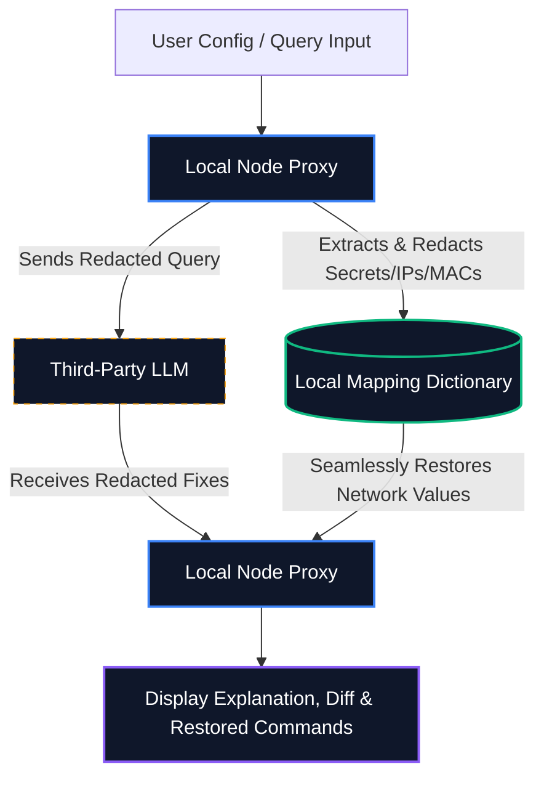

# 🧙‍♂️ MikrotikAssistant: Intelligent RouterOS Assistant with Local Privacy Shielding

<div align="center">

[](https://opensource.org/licenses/MIT)
[](https://nodejs.org/)
[](#)
[](#-privacy-shield-architecture)
[](#-key-features)

**An enterprise-grade, privacy-first AI-powered assistant designed for MikroTik RouterOS (v6 & v7) auditing, debugging, and configuration generation.**

</div>

---

## 🚀 Overview

**MikrotikAssistant** is a professional technical assistant tailored specifically for MikroTik network administrators and engineers. By combining a modern, interactive web-based console with a sophisticated local pre-processing pipeline, the assistant analyzes complex RouterOS scripts, firewall rules, and diagnostic logs without ever exposing sensitive network configurations (such as plain-text passwords, private or public IPs, MAC addresses, and routing details) to external LLM providers.

### Why MikrotikAssistant is Unique
Unlike typical AI integrations that expose raw network configurations, **MikrotikAssistant** enforces an uncompromising **local-first privacy layer**. Before any query leaves your infrastructure, a robust, regex-powered masking engine strips, placeholder-maps, and localizes all confidential network variables. It then seamlessly restores them upon response delivery, ensuring a completely secure and seamless debugging experience.

---

## 🛡️ Privacy Shield Architecture

The privacy shield acts as a local security boundary, intercepting data on the local proxy and returning redacted prompts to the LLM.



### 🔒 Data Masking Coverage

The local masking engine automatically scans, registers, and obfuscates the following parameters before transit:
- **IP Addresses:** Maps IPv4 & IPv6 subnets contextually to `[PRIV_IP_x]` & `[PUB_IP_x]` placeholders.
- **MAC Hardware IDs:** Masks physical hex hardware addresses to `[MAC_x]`.
- **Credentials & Secrets:** Strips passwords, pre-shared keys (WPA/WPA2), PINs, and authentication keys.
- **Custom Interface Names:** Redacts custom bridge or VLAN interfaces to `[IFACE_x]`, while retaining standard RouterOS interfaces (like `ether1` or `wlan1`) for network topology context.
- **Domains & DDNS:** Redacts dynamic DNS domains, cloud names, and external hosts.
- **Router Identity:** Obfuscates `/system identity` custom assignments.

---

## ✨ Key Features

- 🔒 **Local Redaction:** Instant, local scrubbing of configuration secrets before they are transmitted over the WAN.
- 🛡️ **Zero Data Leakage:** Ensure your enterprise security and regulatory compliance are never compromised by AI queries.
- 🚀 **Instant RouterOS Fixes:** Context-aware command generation tailored precisely for your hardware model and OS version (v6 vs v7).
- 🎨 **Next-Gen Cyber WinBox UI:** A premium, fully responsive, and fluid dark terminal interface featuring transition curves and micro-animations.
- 🌐 **Multilingual & Dynamic Localization:** Fully supports local interface switching (English and Italian) with dynamic LLM response translation.
- 📊 **Interactive Comparison Diff:** High-contrast unified or split-screen comparisons to review exact configuration differences before deployment.
- 📋 **Executable Terminal Checklist:** Mark off applied CLI instructions interactively with inline copy utilities.
- 🕒 **Multi-Turn Persistent Chats:** Deep-dive chat persistence using LocalStorage, allowing full context-retention without backend data storage.

---

## 🛠️ How It Works

The masking and unmasking process is completely transparent to the user and runs entirely locally:

1. **Analysis & Tokenization**: When you paste a configuration log or input a query, the application parses the input to extract sensitive properties.
2. **Local Registry Creation**: Private values are stored in a local, short-lived memory registry.
3. **Anonymized Query Submission**: The redacted input is packaged and dispatched securely to the external AI model.
4. **Context-Aware Translation**: The AI processes the request using masked identifiers, keeping your network architecture anonymous.
5. **Dynamic Reconstruction**: Upon receiving the response, the local engine maps the placeholders back to their original values and renders the resolved commands.

---

## 📂 Project Structure

```text
MikrotikAssistant/
├── public/
│   ├── index.html        # Single Page Tailwind CSS Frontend UI (Cyber WinBox layout)
│   ├── app.js            # Main Frontend Javascript (Localization, diff engines & history)
│   └── utils.js          # Pure utility functions (diff computation, Markdown rendering)
├── privacyShield.js      # Robust regex masking & restoration engine
├── server.js             # Express.js backend CORS proxy & system prompt injector
├── test.js               # Lightweight unit & integration test suite
├── package.json          # Dependency definition and operational scripts
└── README.md             # Project documentation and guide
```

---

## 🚀 Quick Start

Get your local instance of **MikrotikAssistant** up and running in less than two minutes.

### Prerequisites
- **Node.js** (v16.x or newer is highly recommended)
- **npm** (comes packaged with Node.js)

### Installation

Clone the repository and install all required dependencies:

```bash
# Clone the repository
git clone https://github.com/yourusername/MikrotikAssistant.git

# Navigate to the project directory
cd MikrotikAssistant

# Install dependencies
npm install
```

### Running the Application

#### Development Environment
Start the development server with real-time output:
```bash
npm start
```

#### Production Environment
For production-grade deployments, it is recommended to manage the Node.js process using a manager like `pm2`:
```bash
# Install PM2 globally if not already installed
npm install pm2 -g

# Start the application
pm2 start server.js --name "mikrotik-assistant"
```

Once started, the application will be accessible locally at: **[http://localhost:3000](http://localhost:3000)**.

---

## 🧪 Running Tests

Validate the privacy pipeline, masking capabilities, and string diff engine using the lightweight, zero-dependency testing harness:

```bash
npm test
```

---

## 🗺️ Roadmap & Contributing

We welcome contributions from the network engineering and open-source communities! If you would like to contribute, please fork the repository, make your changes, and submit a Pull Request.

### Planned Features & Enhancements
- 📁 **RSC File Export:** Seamlessly download corrected scripts directly in `.rsc` format.
- 📊 **Advanced VLAN Parsing:** Graphical visualization of complex bridge-vlan configuration maps.
- ⚡ **Local LLM Support:** Integration with local inference servers (e.g., Ollama, Llama.cpp) for absolute offline execution.

---

## ⚖️ License

This project is licensed under the MIT License. See the [LICENSE](LICENSE) file for details.

Developed with 🧙‍♂️ network wizardry for the MikroTik community.
