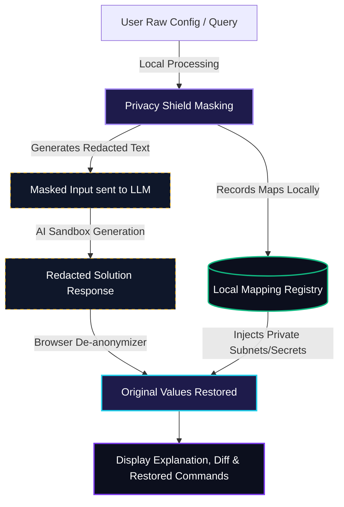

# 🧙‍♂️ Mik the Winbox Wizard — MikroTik Privacy AI Chatbot Assistant

<div align="center">

[](LICENSE)
[](https://nodejs.org/)
[](#-security--privacy-shield)
[](#)

**An enterprise-grade, privacy-first AI-powered assistant designed for MikroTik RouterOS (v6 & v7) configuration auditing, secure debugging, and script generation.**

</div>

---

## 🚀 Overview

**Mik the Winbox Wizard** (or **Mik** for short) is a professional, secure AI network assistant built specifically for MikroTik administrators and network engineers. It combines a state-of-the-art technical conversational interface with an uncompromising local **Privacy Shield** pre-processing pipeline.

With **Mik**, you can audit complex firewall rules, troubleshoot OSPF or BGP peer routing issues, or request configuration scripts tailored exactly to your RouterOS version and hardware model without ever exposing sensitive corporate data (such as passwords, public/private IP addresses, MAC coordinates, or system identity) to third-party LLMs.

---

## 🛡️ Security & Privacy Shield

Security is our core foundation. Mik implements a robust, locally executed data-cleansing pipeline. Before any request is dispatched over the WAN to cloud LLM providers, sensitive context variables are immediately stripped, recorded, and mapped to anonymous placeholders. Once the LLM generates the response in our secure sandbox, the local server restores original values instantly inside your browser.

### 🔒 Privacy Shield Flow

The diagram below illustrates how sensitive information is guarded during transit:



### 🔒 Redaction Coverage

The local masking engine automatically identifies and obfuscates:
* **IP Addresses**: Scans IPv4/IPv6 subnets and maps them contextually to `[PRIV_IP_x]` or `[PUB_IP_x]` placeholders.
* **MAC Hardware IDs**: Redacts raw physical network interface addresses to `[MAC_x]`.
* **Credentials & Keys**: Scrubs passwords, WPA/WPA2 pre-shared keys, shared secrets, PINs, and authentication keys.
* **Interface Names**: Protects custom naming topology (e.g. `bridge-lan-office` to `[IFACE_x]`) while preserving generic terms like `ether1` and `bridge` for layout context.
* **Domains & Dynamic DNS**: Maps DDNS addresses and external lookups to `[DOMAIN_x]`.
* **Router Identity**: Redacts customized system identity hostnames.

---

## ✨ Features

* 🔒 **Local-First Privacy**: Absolute data sanitization occurs strictly before leaving your local server.
* 📁 **RSC File Export**: Download fully corrected configurations directly in native MikroTik `.rsc` script format, packaged with an official standard MikroTik metadata comment header.
* 📊 **Comparative Colored Diff**: High-contrast, interactive unified or split-screen comparisons to visually review configuration modifications before applying them.
* 📋 **CLI Checklist Modal**: Interactively review ready-to-run terminal commands, checking them off as they are pasted into your WinBox CLI terminal.
* 🎨 **Micro-Interactive Cyber WinBox UI**: Premium Apple-inspired easing, fade-in transition cues, theme variables (Light/Dark Modes), and localized interface options.
* 🌐 **Dynamic Multilingual Support**: Deep-integrated dictionaries for English and Italian, matching both system terminology and localized conversational AI output.
* 🕒 **Multi-Turn Persistent Streams**: Store conversation history safely in browser `localStorage`, allowing long-term troubleshooting sessions.

---

## 📂 Project Directory Structure

```text
MikrotikAssistant/
├── public/
│   ├── index.html        # Single Page Tailwind CSS Frontend UI (Cyber WinBox layout)
│   ├── app.js            # Main Frontend Javascript (Localization, diff engines & history)
│   └── utils.js          # Pure utility functions (diff computation, Markdown rendering)
├── privacyShield.js      # Robust regex masking & restoration engine
├── server.js             # Express.js backend CORS proxy & system prompt injector
├── test.js               # Lightweight unit & integration test suite
├── LICENSE               # Open-source MIT License
├── CONTRIBUTING.md       # Guidelines for adding masking rules or parsing features
├── package.json          # Dependency definition and operational scripts
└── README.md             # Project documentation and guide
```

---

## 🚀 Quick Start

Follow these steps to launch Mik the Winbox Wizard on your local machine in under two minutes:

### Prerequisites
* **Node.js** (v16.x or newer is highly recommended)
* **npm** (comes packaged with Node.js)

### Installation

Clone the repository and install the dependencies:

```bash
# Clone the repository
git clone https://github.com/yourusername/MikrotikAssistant.git

# Navigate into the project folder
cd MikrotikAssistant

# Install dependencies
npm install
```

### Running the Application

To start the backend proxy server locally:

```bash
npm start
```

Once running, the application will be accessible at: **[http://localhost:3000](http://localhost:3000)**.

To customize your AI execution, open the **Wizard Control Center** sidebar, click on the **Prefs** tab, and enter your LLM provider credentials (supports OpenAI, Anthropic, OpenRouter, Local Ollama, or Custom Gateways).

---

## 🧪 Verification and Testing

To verify the integrity of the Privacy Shield engine and utility modules, run the zero-dependency test suite:

```bash
npm test
```

The testing suite validates:
1. Subnet classification (Private vs. Public IPv4/IPv6).
2. Masking/Redaction pipeline integrity.
3. Multi-turn conversation restoration safety.
4. Line-by-line configuration comparison diff computation.
5. Custom RouterOS markdown block styling parsing.

---

## 🤝 Contributing

We welcome contributions from the network engineering, open-source, and cybersecurity communities! If you would like to contribute new regex filters, parse rules, or theme updates, please review our [CONTRIBUTING.md](CONTRIBUTING.md) guidelines first.

---

## ⚖️ License

This project is licensed under the MIT License. See the [LICENSE](LICENSE) file for details.

---

<div align="center">
Developed with network wizardry for the MikroTik community.
</div>
