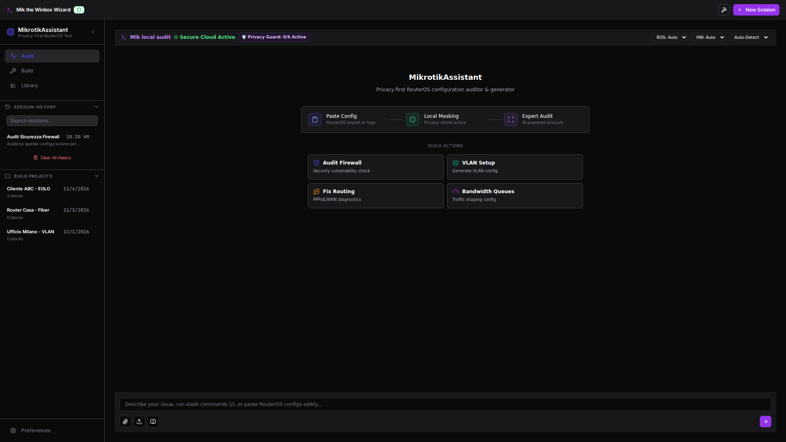
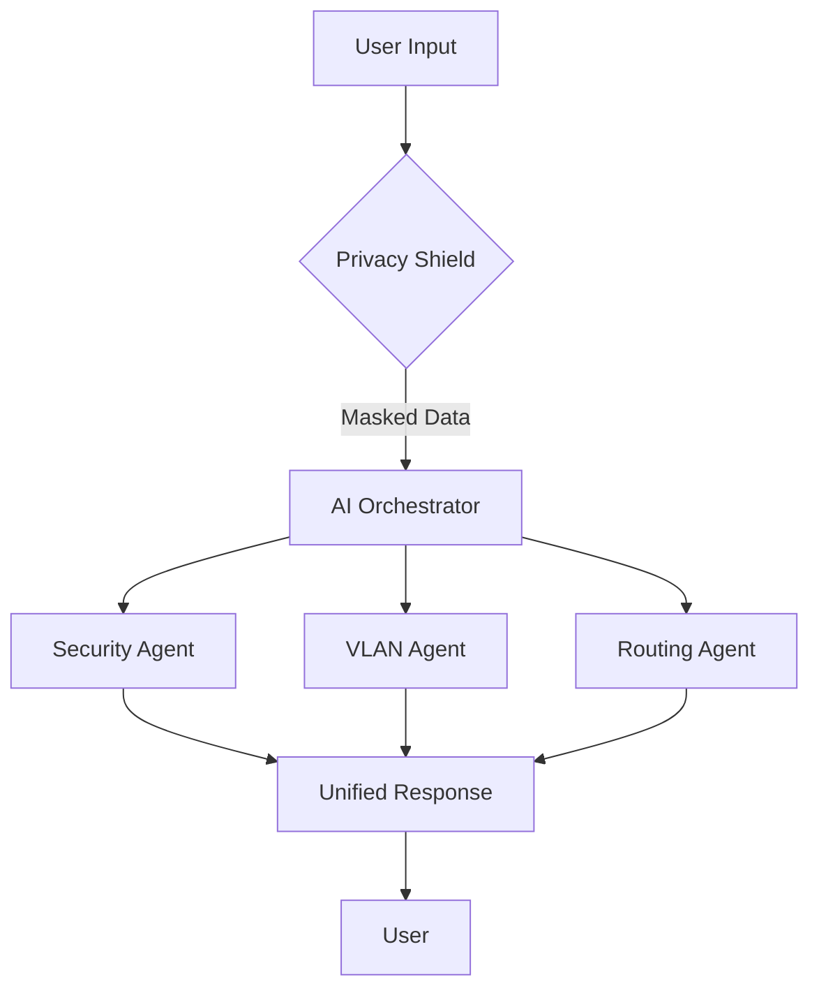

# MikrotikAssistant

[](https://opensource.org/licenses/MIT)
[](https://nodejs.org/)
[](https://github.com/Angelo-builds/MikrotikAssistant)

**Privacy-First MikroTik RouterOS Configuration Auditor & Builder**

<p align="center">
  
</p>

## 🚀 Quick Start

### Local Installation
```bash
git clone https://github.com/Angelo-builds/MikrotikAssistant.git
cd MikrotikAssistant
npm install
npm start
# Access at http://localhost:3000
```

### Docker Deployment
```bash
# Using Docker Compose
docker-compose up -d

# Or manually
docker build -t mikrotik-assistant .
docker run -p 3000:3000 mikrotik-assistant
```

## ✨ Features

### 🔒 Privacy-First Architecture
- **Local Privacy Shield**: Masks IPs, MACs, passwords BEFORE sending to AI
- **Ephemeral API Keys**: Keys stored only in memory (RAM), never in localStorage
- **Backend Environment Variables**: Optional server-side key storage

### 🤖 AI-Powered Audit
- Multi-Agent Orchestrator (Security, VLAN, Routing specialists)
- Automatic vulnerability detection
- Visual diff viewer
- Mermaid.js topology diagrams
- Smart command extraction

### 🛠️ Configuration Builder
- Variable-driven templates
- Auto-calculated derived variables (gateway, broadcast, subnet)
- Conditional blocks (IF/ENDIF logic)
- Drag-and-drop block reordering
- Monaco Editor integration
- Live preview

### 📚 Template Library
- Pre-built blocks (Firewall, NAT, DHCP, BGP, etc.)
- Custom block creation
- Export/Import JSON format
- Project auto-save

## 📸 Screen Showcase

### 1. Hero / Main View
The clean, modern Audit Tab landing page provides quick start action shortcuts, custom-designed icons, and a step-by-step visual audit flow guide.
- **Dark Mode:** `docs/screenshots/hero-dark.png`
- **Light Mode:** `docs/screenshots/hero-light.png`

### 2. Active Chat & Privacy Shield
Paste your exports safely. The fully client-side Privacy Shield scrubs and masks private variables before sending data to secure AI environments.
- **Dark Mode:** `docs/screenshots/audit-chat-dark.png`
- **Light Mode:** `docs/screenshots/audit-chat-light.png`

### 3. Multi-Agent Orchestrator Response
Parallel specialized RouterOS expert agents (Security, VLAN, Routing) analyze configurations to produce isolated vulnerability insights and unified fix scripts.
- **Dark Mode:** `docs/screenshots/multi-agent-dark.png`
- **Light Mode:** `docs/screenshots/multi-agent-light.png`

### 4. Configuration Builder
Interactive three-column modular builder combining localized variable inputs on the left, configuration block cards in the center, and live syntax preview on the right.
- **Dark Mode:** `docs/screenshots/builder-dark.png`
- **Light Mode:** `docs/screenshots/builder-light.png`

### 5. Template Library
Preset template configs (such as EOLO, WISP, Fiber DHCP, or Home Routers) and saved client projects with export and import workflows.
- **Dark Mode:** `docs/screenshots/library-dark.png`
- **Light Mode:** `docs/screenshots/library-light.png`

### 6. Preferences & Advanced Controls
Manage LLM models (OpenRouter, OpenAI, local Ollama), configure API keys/backend environments, toggle dark/light appearance, and control fine-grained mask settings.
- **Dark Mode:** `docs/screenshots/preferences-dark.png`
- **Light Mode:** `docs/screenshots/preferences-light.png`

### 7. Collapsed Sidebar & Responsive Layout
Demonstrates the fluid space-saving collapsed sidebar navigation (48px) and flexible mobile viewports.
- **Collapsed Sidebar:** `docs/screenshots/sidebar-collapsed.png`
- **Mobile Responsive (375x812):** `docs/screenshots/mobile-view.png`

## 📖 Documentation

### Installation Methods

<details>
<summary><strong>Local Installation (Recommended for Development)</strong></summary>

**Prerequisites:**
- Node.js 20+
- npm or yarn

**Steps:**
1. Clone repository
2. Install dependencies: `npm install`
3. Configure environment (optional):
   ```bash
   cp .env.example .env
   # Edit .env with your API key
   ```
4. Start server: `npm start`
5. Open http://localhost:3000

</details>

<details>
<summary><strong>Docker Deployment (Recommended for Production)</strong></summary>

**Prerequisites:**
- Docker 20+
- Docker Compose 2+

**Steps:**
1. Clone repository
2. Configure environment:
   ```bash
   cp .env.example .env
   # Edit .env with your settings
   ```
3. Start container: `docker-compose up -d`
4. Access at http://localhost:3000
5. View logs: `docker-compose logs -f`

**Environment Variables:**
| Variable | Description | Default |
|----------|-------------|---------|
| LLM_API_KEY | Your AI provider API key | (required) |
| LLM_PROVIDER | AI provider (openrouter/openai/ollama) | openrouter |
| LLM_MODEL | Model name | meta-llama/llama-3-8b-instruct:free |
| PORT | Application port | 3000 |

</details>

<details>
<summary><strong>Self-Hosting on VPS</strong></summary>

**Using PM2:**
```bash
npm install -g pm2
pm2 start server.js --name mikrotik-assistant
pm2 startup
pm2 save
```

**Using systemd:**
```ini
[Unit]
Description=MikrotikAssistant
After=network.target

[Service]
Type=simple
User=www-data
WorkingDirectory=/opt/mikrotik-assistant
ExecStart=/usr/bin/node server.js
Restart=on-failure
RestartSec=10

[Install]
WantedBy=multi-user.target
```

</details>

## 🎯 Usage Guide

### Audit Tab
1. Paste RouterOS config or describe issue
2. Use Smart Chips for quick actions
3. Review AI analysis
4. Apply suggested fixes

### Build Tab
1. Define variables (e.g., {{PUBLIC_NETWORK}})
2. Select/configure blocks
3. Preview live output
4. Export .rsc file

### Library
- Save projects
- Import/export templates
- Manage custom blocks

## 🏗️ Architecture


```mermaid
graph TD
    A[User Input] --> B{Privacy Shield}
    B -->|Masked Data| C[AI Orchestrator]
    C --> D[Security Agent]
    C --> E[VLAN Agent]
    C --> F[Routing Agent]
    D --> G[Unified Response]
    E --> G
    F --> G
    G --> H[User]
```

## 🔧 Configuration

### AI Providers

**OpenRouter:**
```env
LLM_PROVIDER=openrouter
LLM_API_KEY=sk-or-...
LLM_MODEL=meta-llama/llama-3-8b-instruct:free
```

**OpenAI:**
```env
LLM_PROVIDER=openai
LLM_API_KEY=sk-...
LLM_MODEL=gpt-4o-mini
```

**Ollama (Local):**
```env
LLM_PROVIDER=ollama
LLM_MODEL=llama3
# No API key needed
```

## 🛡️ Security

- API keys never stored in localStorage
- All sensitive data masked before AI processing
- CORS enabled only for trusted origins
- Rate limiting on API endpoints

## 🤝 Contributing

1. Fork repository
2. Create feature branch: `git checkout -b feature/amazing-feature`
3. Commit changes: `git commit -m 'Add amazing feature'`
4. Push to branch: `git push origin feature/amazing-feature`
5. Open Pull Request

##  License

MIT License - see [LICENSE](LICENSE) for details.

## 🙏 Acknowledgments

- Monaco Editor (MIT)
- Mermaid.js (MIT)
- Tailwind CSS (MIT)
- Lucide Icons (ISC)

## 📞 Support

- GitHub Issues: https://github.com/Angelo-builds/MikrotikAssistant/issues
- Discussions: https://github.com/Angelo-builds/MikrotikAssistant/discussions
