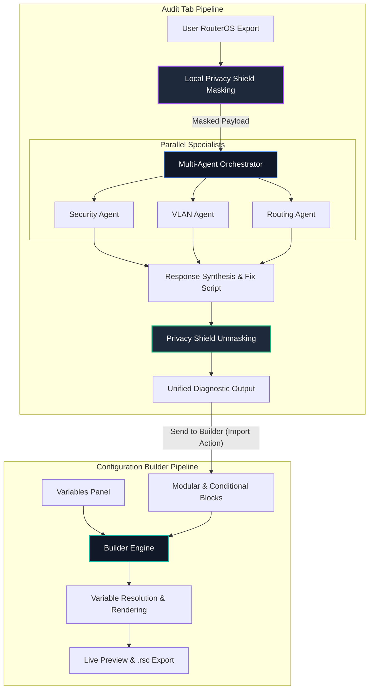

# MikrotikAssistant

<div align="center">

[](LICENSE)
[](https://nodejs.org/)
[](#-privacy-shield)
[](#-ai-integration)
[](#)

**Privacy-First MikroTik RouterOS Configuration Auditor & Builder**

</div>

---

## 📋 Table of Contents
1. [Overview](#1-overview)
2. [Features Overview](#2-features-overview)
3. [Architecture Diagram](#3-architecture-diagram)
4. [Installation & Setup](#4-installation--setup)
5. [Usage Guide](#5-usage-guide)
6. [Advanced Features](#6-advanced-features)
7. [AI Integration & Privacy Shield](#7-ai-integration--privacy-shield)
8. [Development & Contributing](#8-development--contributing)
9. [License & Credits](#9-license--credits)

---

## 1. Overview

**MikrotikAssistant** is a production-grade web utility designed for network engineers, administrators, and security specialists to audit, construct, and maintain MikroTik RouterOS configurations. The application combines a localized, zero-trust **Privacy Shield** data masking pipeline with a **Multi-Agent AI Orchestrator** to analyze router exports without exposing sensitive credentials or IPs to public LLMs. Additionally, a reactive **Configuration Builder** provides modular block construction, automatic subnet calculations, live previews, and templates.

---

## 2. Features Overview

### 🤖 AI Audit Assistant
* **Privacy Shield**: Local sanitization engine that masks IP addresses (public and private), MAC addresses, custom interfaces, passwords, keys, and device names before sending payloads to LLMs, restoring them seamlessly in-memory on response arrival.
* **Multi-Agent Orchestrator**: Executes specialized, parallel diagnostic processes (Security, VLAN, and Routing agents) to provide comprehensive configuration analysis and delta remediation scripts.
* **Smart Chips & Intent Detection**: Automatically identifies if the pasted input is a RouterOS backup/script and suggests context-appropriate action chips (e.g., VLAN Topology, Firewall Security Audit, Multi-Agent Analysis).
* **Visual Diff Viewer**: Displays a side-by-side comparative diff of original and corrected configurations using secure masked values.
* **Mermaid.js VLAN Topology**: Parses active Layer-2 configurations to render interactive, zoomable network bridge topology flowcharts inline.
* **Slash Commands & Context Modifiers**: Access dedicated diagnostic routines using `/audit`, `/explain`, and `/queue`, and adjust technical depth using `@strict`, `@beginner`, and `@wiki` inline modifiers.
* **Export to `.rsc` & Copying**: Offers one-click actions to copy generated CLI delta scripts directly or export them as standard MikroTik `.rsc` files.

### 🛠️ Configuration Builder
* **Shared Variables & Auto-Derivation**: Auto-calculates network parameters (Gateway, Subnet Mask, First/Last Host, Broadcast, Wildcard) dynamically from CIDR network definitions (e.g., `192.168.88.0/24`).
* **Modular Configuration Blocks**: Build structured RouterOS configurations using drag-and-drop blocks covering Firewall, NAT, DHCP, Bridge, PPPoE, BGP, and Simple Queues.
* **Conditional Blocks**: Inject logic with standard `# IF [condition]` / `# ENDIF` conditional blocks supporting variables such as `ROUTEROS_VERSION` or custom boolean toggles.
* **Drag-and-Drop Reordering**: Intuitively reorder blocks to enforce valid dependency loading and firewall rule prioritization.
* **Monaco Editor Integration**: In-app syntax highlighting and advanced editing controls calibrated for RouterOS scripts.
* **Live Preview**: Instantly updates and displays the rendered `.rsc` output as blocks or variables are edited.
* **Configuration Parser**: Import existing `.rsc` backup files to automatically decompose configurations into modular blocks and extract declared parameters as variables.
* **Config Validator**: Scans inputs for duplicate IPs, overlapping subnets, missing gateway variables, and block dependency failures (e.g., DHCP Server without LAN Bridge).
* **Diff Comparison**: In-app visual comparator to compute modifications between any two distinct configuration blocks.
* **Preset System & Personal Library**: Bootstrap setups using pre-configured presets (EOLO, Fiber/DHCP, Basic Home Router) and save custom structures directly to your Local Storage library.

---

## 3. Architecture Diagram

The diagram below details the data flow of both the AI Audit Assistant and the Configuration Builder pipelines, highlighting their integration and local security boundaries.


```mermaid
graph TD
    %% Audit Pipeline
    subgraph Audit Tab Pipeline
        A[User RouterOS Export] --> B[Local Privacy Shield Masking]
        B -->|Masked Payload| C[Multi-Agent Orchestrator]
        subgraph Parallel Specialists
            C --> D1[Security Agent]
            C --> D2[VLAN Agent]
            C --> D3[Routing Agent]
        end
        D1 & D2 & D3 --> E[Response Synthesis & Fix Script]
        E --> F[Privacy Shield Unmasking]
        F --> G[Unified Diagnostic Output]
    end

    %% Builder Pipeline
    subgraph Configuration Builder Pipeline
        H[Variables Panel] --> I[Builder Engine]
        J[Modular & Conditional Blocks] --> I
        I --> K[Variable Resolution & Rendering]
        K --> L[Live Preview & .rsc Export]
    end

    %% Data Exchange
    G -->|"Send to Builder (Import Action)"| J

    style B fill:#1e293b,stroke:#a855f7,stroke-width:2px,color:#fff
    style F fill:#1e293b,stroke:#10b981,stroke-width:2px,color:#fff
    style C fill:#111827,stroke:#3b82f6,stroke-width:1px,color:#fff
    style I fill:#111827,stroke:#14b8a6,stroke-width:2px,color:#fff
```

---

## 4. Installation & Setup

Follow these instructions to run MikrotikAssistant on macOS, Linux, or Windows.

### Prerequisites
* **Node.js**: Version `18.x` or newer.
* **npm**: Installed with Node.js.
* **Ollama (Optional)**: For 100% offline, local AI audit capabilities.

### Step-by-Step Installation

1. **Clone the Repository:**
   ```bash
   git clone https://github.com/yourusername/MikrotikAssistant.git
   cd MikrotikAssistant
   ```

2. **Install Dependencies:**
   ```bash
   npm install
   ```

3. **Configure Environment Variables (Optional):**
   Set default backend AI options (e.g., local Ollama or OpenRouter models):
   ```bash
   # On macOS/Linux:
   export LLM_PROVIDER=ollama
   export LLM_MODEL=llama3
   export LLM_BASE_URL=http://localhost:11434

   # On Windows (Command Prompt):
   set LLM_PROVIDER=ollama
   set LLM_MODEL=llama3
   set LLM_BASE_URL=http://localhost:11434
   ```

4. **Start the Application:**
   ```bash
   npm start
   ```

5. **Access the Web Console:**
   Open your browser and navigate to **[http://localhost:3000](http://localhost:3000)**.

---

## 5. Usage Guide

### Audit Tab Example
1. Navigate to the **Audit** interface.
2. Paste a standard RouterOS backup export (e.g., containing `/ip firewall filter` or `/interface bridge`).
3. Notice that **Smart Chips** automatically slide into view. Select one, such as `🛡️ Audit Sicurezza Firewall` (Firewall Security Audit).
4. Append context modifiers like `@strict` to focus your analysis on hardened security compliance.
5. Submit the query. The orchestrator will trigger specialized security and routing agents, returning:
   - A critical issues checklist.
   - A visual topology map of detected interfaces.
   - Copyable CLI scripts containing remediation delta commands.
6. Click **Send to Builder** on any output block to load it directly into the configuration template workbench.

### Builder Tab Example
1. Navigate to the **Build** tab.
2. In the **Variables Panel**, declare `LAN_NETWORK` as `192.168.100.0/24`.
3. The **Auto-Derived Variables** list instantly populates:
   - `LAN_GATEWAY` = `192.168.100.1`
   - `LAN_FIRST_HOST` = `192.168.100.1`
   - `LAN_LAST_HOST` = `192.168.100.254`
   - `LAN_BROADCAST` = `192.168.100.255`
4. Toggle active **Configuration Blocks** (e.g., enable System Identity, DHCP Server, and Basic Firewall).
5. Add a conditional block by clicking **Add Conditional**, configure the rule to `ROUTEROS_VERSION == 7`, and write version-specific commands (such as WireGuard configurations).
6. Verify the consolidated output in the **Live Preview** column on the right.
7. Click **Export .rsc** to download your custom-built script.

---

## 6. Advanced Features

### Custom Presets & Library Templates
The application supports persistent browser-based configuration management. To create your own preset:
* Arrange your required variables and configuration blocks.
* Click **Save to Library** and name your project (e.g., `Branch Office Setup v1.1`).
* This setup is saved securely to browser Local Storage and can be recalled or deleted from the **Library** tab at any time.

### Configuration Parsing & Deconstruction
Use the **Import .rsc** tool to ingest raw CLI configuration scripts:
* The backend parser splits commands by configuration namespaces (e.g., `/ip dhcp-server`, `/ip firewall nat`).
* Extracted subnet addresses are converted to variables.
* The parsed sections are converted into modular blocks, allowing you to reorder, validate, and compare them.

### Conditional Syntax Logic (`IF/ENDIF`)
Configuration rendering evaluates standard logical conditionals before exporting the final script:
```routeros
# IF ROUTEROS_VERSION == 7
/routing bgp connection
add name=bgp-conn local.role=ebgp
# ENDIF

# IF ROUTEROS_VERSION == 6
/routing bgp peer
add name=bgp-peer
# ENDIF
```

### Config Validator & Diff Viewer
* **Validation**: Clicking **Validate** initiates a local dependency audit, identifying common deployment errors (e.g., overlapping static IP subnets or unassigned gateway definitions) before you run the code on live devices.
* **Compare**: Click **Compare** to paste two independent configurations; the built-in diff utility renders a split-screen or unified view highlighting added, deleted, or modified lines.

---

## 7. AI Integration & Privacy Shield

```
User Input ──► [ Local Privacy Shield Masking ] ──► [ AI API Connection ]
                                                            │
User Output ◄── [ Local Privacy Shield Unmasking ] ◄────────┘
```

### Supported Providers
* **OpenAI**: Connects to official models (e.g., `gpt-4o`, `gpt-4o-mini`).
* **OpenRouter**: Access open weights models (e.g., `meta-llama/llama-3-8b-instruct:free`).
* **Ollama**: Connects to localized models (e.g., `llama3`, `mistral`) for complete offline auditing.

### Secure Local Masking (Privacy Shield)
Before any prompt exits your host machine, `privacyShield.js` matches and masks sensitive tokens:
* **IP Addresses**: Maps public and private IPs (`192.168.88.10` becomes `[PRIV_IP_1]`).
* **Passwords & Secrets**: Replaces security keys and credentials with `[SECURE_SECRET_X]`.
* **MAC Addresses**: Replaces physical MAC addresses with `[MAC_ADDR_X]`.
* **Identities**: Overwrites host and identity fields with standard placeholder variables.

Once the LLM returns the structured diagnostics, the frontend restores the original network tokens from an in-memory dictionary. Sensitive variables never leave your browser context or hit LLM logs.

---

## 8. Development & Contributing

### Directory Structure
```
├── backend/
│   └── builder/
│       ├── parser.js        # .rsc parser and importer
│       └── validator.js     # IP and configuration dependency validator
├── public/
│   ├── css/
│   └── js/
│       ├── builder/         # Core engine, diff viewer, Monaco editor integration
│       └── components/      # UI Layout components (Audit, Builder, Library, Sidebar)
├── agents.js                # AI Specialist agent system prompts
├── privacyShield.js         # Masking/unmasking regex engine
└── server.js                # Express entry point and proxy routes
```

### Extending the Application
* **Adding New Blocks**: Edit `public/js/builder/engine.js` under `loadDefaultBlocks()` to add custom template variables.
* **Adding Agent Prompts**: Edit `agents.js` to refine guidelines for the Security, VLAN, or Routing agents.
* **Extending the Parser**: Edit `backend/builder/parser.js` to add support for new RouterOS namespaces or syntax variations.

Please format your JavaScript according to standard ES6 guidelines and verify all changes with the built-in test runner (`npm test`) before submitting pull requests.

---

## 9. License & Credits

Licensed under the **MIT License**. See [LICENSE](LICENSE) for details.

### Technologies Used
* **Monaco Editor**: High-fidelity code editor.
* **Mermaid.js**: Responsive, local canvas rendering for network layouts.
* **Tailwind CSS**: Utility-first styling framework.
* **jsdiff**: Underpins comparative and side-by-side diff viewers.

---
<div align="center">
Designed for the global MikroTik network engineering community.
</div>